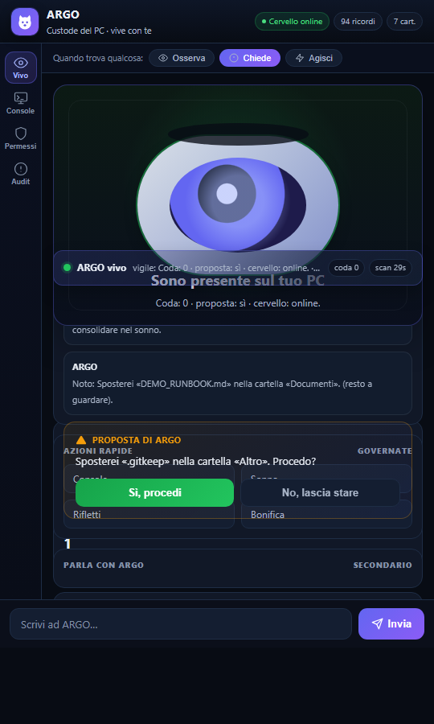
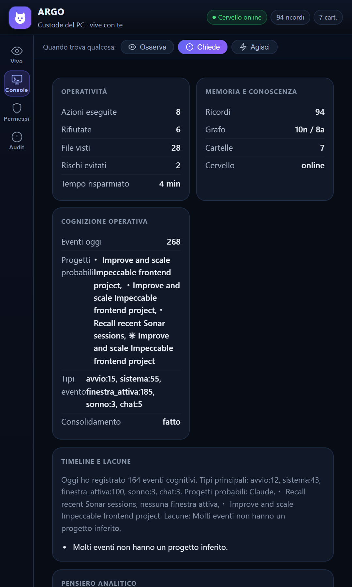
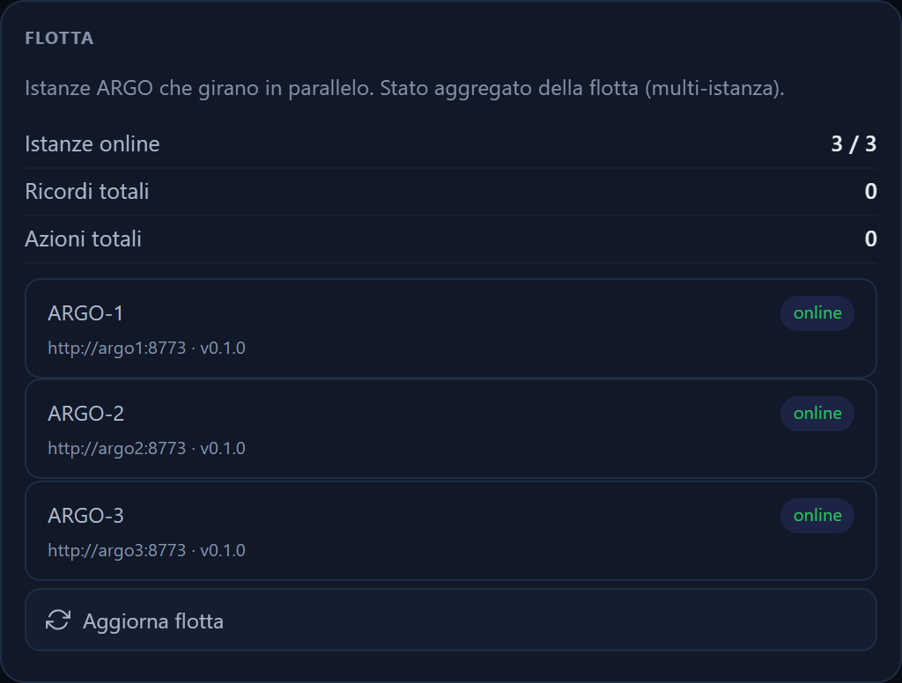
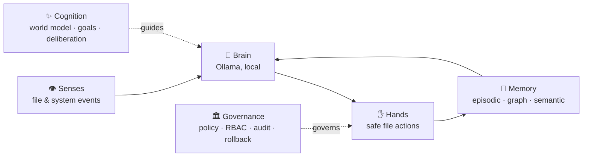

<div align="center">


# ARGO

**A local-first AI that lives on your PC. It watches, remembers, learns, and acts — 100% offline.**

Not a chatbot you query and forget. ARGO perceives what happens on your machine, reasons about it with a local LLM, remembers across sessions, and — only when you allow it — takes action. The longer it works with you, the more useful it gets, because the memory is *yours* and it never leaves your computer.

[](LICENSE)
[](https://www.python.org/)
[](https://ollama.com/)
[](#requirements)
[](#privacy)
[](CONTRIBUTING.md)
<br/>
[](https://github.com/mattiolocoding/argo/actions/workflows/ci.yml)
[](https://github.com/mattiolocoding/argo/actions/workflows/docker.yml)

⭐ **If ARGO resonates with you, [star the repo](https://github.com/mattiolocoding/argo) — it helps others find it.**

</div>

---

<div align="center">

<br/>
<sub>ARGO watching the PC, proposing a file action, and waiting for your one-click approval.</sub>
</div>

---

## Install in one command

**Windows** (PowerShell) — sets everything up and launches the desktop app:

```powershell
irm https://raw.githubusercontent.com/mattiolocoding/argo/main/install.ps1 | iex
```

**Docker** (any OS) — run the engine, open the UI in your browser:

```bash
docker run -p 8780:8773 --add-host=host.docker.internal:host-gateway ghcr.io/mattiolocoding/argo:latest
# then open http://127.0.0.1:8780
```

**Linux / macOS** (engine):

```bash
curl -fsSL https://raw.githubusercontent.com/mattiolocoding/argo/main/install.sh | bash
```

After installing, the `argo` command is on your PATH:

```
argo            # desktop app (default)
argo engine     # headless engine (server / container)
argo fleet      # aggregated status across instances
argo version
```

> ARGO needs a local [Ollama](https://ollama.com) for its brain. The installer pulls the
> models for you; the Docker engine talks to your host's Ollama. Everything stays on your machine.

---

## Why ARGO

Most AI today is *rented and amnesiac*: it starts from zero every time, runs on someone else's cloud with your data, and disappears when the server is shut off.

ARGO inverts that:

- **It remembers, forever.** A layered memory (episodic + knowledge graph + semantic vectors) that grows in the direction of *your* life and work.
- **It runs entirely on your machine.** The reasoning model is [Ollama](https://ollama.com/), local. No account, no API key, no telemetry. Your data never leaves the PC.
- **It acts under your control.** Three autonomy levels (Observe / Ask / Act), a runtime policy engine, role-based access, a tamper-evident audit log, and one-click rollback of any action.

The real moat isn't the model — it's the **accumulated, private memory**. The longer ARGO works with you, the more irreplaceable it becomes.

## What it does today

ARGO's first craft is being the **keeper of your PC**:

- 👁 **Watches** your folders (Desktop, Downloads, Documents, Images, Music, Video) and reacts to new files.
- ✋ **Tidies** files by type / date / project, asking for confirmation (or acting on its own, if you tell it to).
- 🔁 **Spots** duplicates and clutter ("you have 40 PDFs in Downloads").
- 🧠 **Learns** your habits: it stops proposing what you reject, and starts doing what you always accept.
- 💾 **Remembers** everything between sessions and builds a graph of relationships.
- 🔎 **Finds by meaning** through semantic memory (embeddings).
- 🔌 **Wakes its own brain**: starts Ollama if it's off, reconnects on its own, launches at boot.

## A look inside

<div align="center">

&nbsp;&nbsp;

<br/>
<sub>Left: the operational Console (metrics · memory · cognition). Right: the Fleet card — three ARGO instances running in Docker, aggregated live.</sub>
</div>

## Architecture



The life loop: **perceive → recall → think → (decide, per autonomy level) → act → verify → remember → repeat**, always, in the background.

| Layer | Module | What it provides |
|---|---|---|
| Engine | `motore_web.py` | Headless local API on `127.0.0.1:8773` (stdlib `http.server`, zero web framework) |
| Brain | `cervello.py`, `modelli.py` | Ollama client + a model mesh that routes by complexity (reflex / reasoner / expert) |
| Memory | `memoria/` | Episodic diary, knowledge graph, semantic vectors (all SQLite) |
| Hands | `mani/` | Guard-railed file actions (move / rename / archive), duplicate & clutter detection |
| Senses | `sensi.py`, `sistema.py` | Active window, network, clipboard *metadata*, disk, processes |
| Governance | `governo/` | Policy engine, roles (RBAC), hash-chain audit, rollback, metrics, nightly consolidation |
| Cognition | `cognizione/` | World model, internal journal, long-term goals, best-of-N deliberation |
| Security | `sicurezza.py` | Sensitive-file protection, secret redaction, tamper-evident audit, DPAPI key protection |
| UI | `ui/index.html` | Dark, single-file dashboard (Chat / Console / Permissions / Audit) |

## Manual setup (from source)

> Prefer the [one-command install](#install-in-one-command) above. This is the manual path.
> ARGO targets **Windows** and a local **[Ollama](https://ollama.com/)** install.

```powershell
# 1. Install Ollama and pull models (chat + embeddings)
ollama pull qwen2.5:7b-instruct
ollama pull nomic-embed-text

# 2. Get ARGO
git clone <your-fork-url> argo
cd argo

# 3. Create an isolated environment
python -m venv .venv
.\.venv\Scripts\Activate.ps1

# 4. (Optional) install the native desktop window
pip install -r requirements.txt

# 5. Run it
python argo_app.py        # native desktop app (Qt), or:
python motore_web.py      # engine + window
```

The engine exposes a local API you can inspect in any browser:

```
http://127.0.0.1:8773/stato      → live status (brain, memories, folders)
http://127.0.0.1:8773/console    → full dashboard data
http://127.0.0.1:8773/audit      → tamper-evident audit log
```

No models? No window library? ARGO **degrades gracefully**: it still runs, opens in your browser, and tells you what's missing.

### Run with Docker

The native desktop app stays native (a container has no GUI), but the **headless
engine** (API + the same web UI, served over HTTP) runs great in a container, and
multiple containers make a ready-made [fleet](#scaling). The engine is stdlib-only,
so the image is small and needs no `pip install`.

```bash
docker compose up -d --build
# open the UI:        http://127.0.0.1:8780
# live status:        http://127.0.0.1:8780/stato
```

The container reaches your host's Ollama via `host.docker.internal`. Verified: the
containerized engine starts healthy, serves the UI, and connects to the host LLM.

**Fleet demo** (horizontal scaling) — three instances on one network, one aggregating the others:

```bash
docker compose -f docker-compose.fleet.yml up -d --build
curl http://127.0.0.1:8781/flotta     # argo1 reports all three instances online
```

**Self-contained stack** — Ollama in a container too, nothing preinstalled on the host:

```bash
docker compose -f docker-compose.ollama.yml up -d --build
docker compose -f docker-compose.ollama.yml exec ollama ollama pull qwen2.5:7b-instruct
# then open http://127.0.0.1:8780
```

**Prebuilt image** — CI publishes the engine image to GitHub Container Registry on every push:

```bash
docker pull ghcr.io/mattiolocoding/argo:latest
```

## Privacy

ARGO is local by design:

- The LLM runs on your machine via Ollama. **Nothing is sent to any cloud.**
- The API binds to `127.0.0.1` only.
- Sensitive files and secrets are **never read, indexed, or moved** — they are detected and skipped.
- Every action is recorded in a **hash-chained audit log** you can export and verify.
- The local key is protected with Windows **DPAPI**; encryption at rest is optional.

## Autonomy levels

For each kind of task, *you* decide how much ARGO may dare. The safe default is **Ask**.

| Level | Behavior |
|---|---|
| 🟢 **Observe** | Looks and reports. Touches nothing. |
| 🟡 **Ask** *(default)* | Proposes the action; you approve with one click. |
| 🔴 **Act** | Does it on its own and tells you afterward. For tasks you trust. |

## Project status

ARGO is **alpha** and Windows-first. The core (memory, brain, hands, governance, engine) runs and is covered by module self-tests; some enterprise layers (deep workflows, fleet/multi-instance, signed packaging) are in progress. See [`docs/STATO_PROGETTO.md`](docs/STATO_PROGETTO.md) for the living status (Italian) and the [roadmap](#roadmap) below.

## Roadmap

- [x] Persistent layered memory (episodic + graph + semantic)
- [x] Guard-railed file actions with 3 autonomy levels
- [x] Governance: policy, RBAC, hash-chain audit, rollback, metrics
- [x] Cognition v0: world model, goals, deliberation
- [x] Model mesh routing by complexity
- [ ] End-to-end workflows inside the engine
- [ ] Temporal knowledge graph (validity over time)
- [ ] Fleet / multi-instance with a central console
- [ ] Voice & presence, mobile companion
- [ ] Signed packaging + auto-update

## Documentation

The design docs live at the repo root (currently in Italian, translations welcome):
[`docs/PROGETTO_ARGO.md`](docs/PROGETTO_ARGO.md) (the "bible"), [`docs/ARGO_VISIONE_ENTERPRISE.md`](docs/ARGO_VISIONE_ENTERPRISE.md) (vision), [`docs/PIANO_LAVORO.md`](docs/PIANO_LAVORO.md) (work plan), [`docs/SICUREZZA_REPORT.md`](docs/SICUREZZA_REPORT.md) (security report), [`docs/COSA_OFFRE_ARGO.md`](docs/COSA_OFFRE_ARGO.md) (full capability catalog).

## Project layout

```
argo/
├─ motore_web.py        engine: local API on 127.0.0.1:8773 (stdlib http.server)
├─ serve.py · cli.py    headless entrypoint · `argo` CLI launcher
├─ cervello.py modelli.py     brain (Ollama) + model-mesh routing
├─ sensi.py sistema.py        senses (window/network/clipboard, disk/processes)
├─ sicurezza.py               security: secrets, hash-chain audit, DPAPI
├─ workflow.py fleet.py       workflow engine · horizontal fleet
├─ memoria/                   episodic + graph + semantic memory (SQLite)
├─ governo/                   policy · RBAC · audit · rollback · metrics · sleep
├─ cognizione/                world model · goals · journal · experiments
├─ connettori/  mani/  config/   connectors · safe file actions · settings
├─ ui/index.html              single-file dark dashboard
├─ assets/                    logo + screenshots
├─ deploy → Dockerfile, docker-compose*.yml, install.ps1/.sh
├─ tests/  scripts/  docs/    tests · dev scripts · project docs
└─ produzione/                native packaging (PyInstaller, installer)
```

## Contributing

Contributions are welcome. See [CONTRIBUTING.md](CONTRIBUTING.md) and the [Code of Conduct](CODE_OF_CONDUCT.md). Good first areas: translating docs to English, the workflow engine, the temporal graph, and packaging.

## License

[MIT](LICENSE) — do what you want, keep the notice. ARGO is yours to run, fork, and own.

> Not affiliated with the Argo Project (Argo CD / Workflows).
